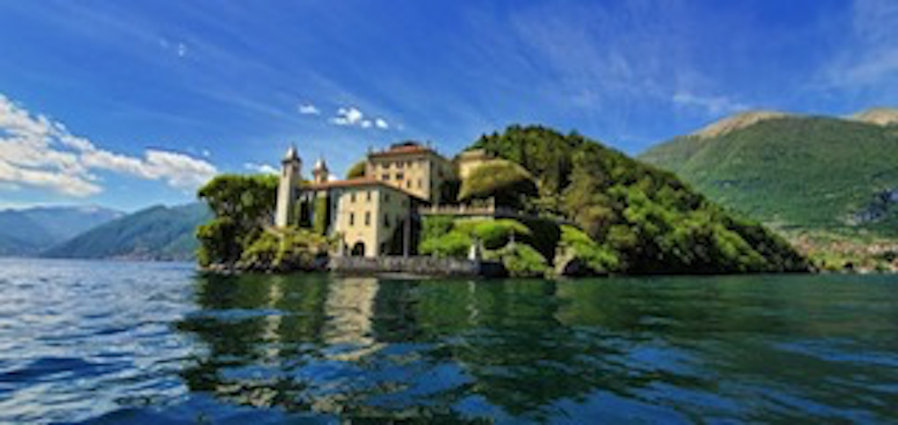

# High–Low Resolution Image Blender

Blends a high-resolution patch (with transparency) into its corresponding
low-resolution photo by combining:

1. **AKAZE** keypoint detection & description  
2. **BFMatcher** + Lowe’s ratio test for robust feature matching  
3. **RANSAC** homography estimation  
4. Back-warping the patch and **alpha compositing** for seamless fusion  

---
## 1  Quick start
```bash
python -m venv venv && source venv/bin/activate   # optional
pip install -r requirements.txt

python blend.py \
       --low desert_low_res.jpg \
       --high desert_high_res.png \
       --out desert_blended.jpg --show
```
---
## 2  Demo
### Input: Low-Resolution Lake


### Output: Refined Lake

