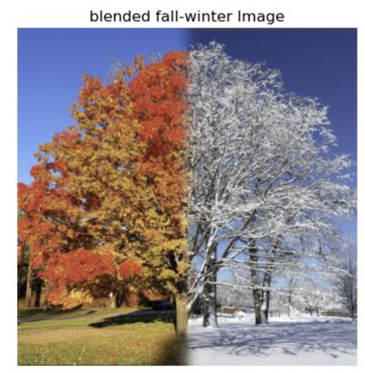
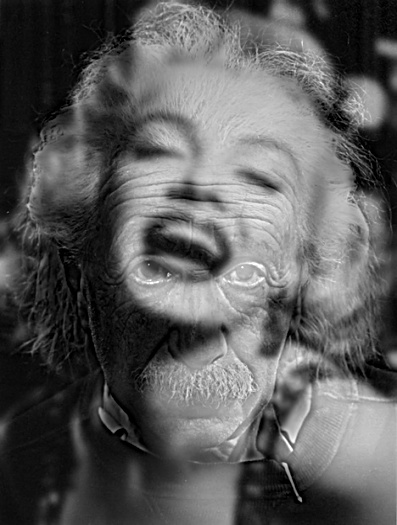

# Pyramid-Blending CLI

Tiny, dependency-light command-line tool that demonstrates two multi-resolution
image tricks:

| Mode | What it does | Typical result |
|------|--------------|----------------|
| **blend** | Laplacian-pyramid blends two **RGB** images, guided by a single-channel **mask**. Each scale fades smoothly between the pictures, giving a seamless composite. |  |
| **hybrid** | Merges the **high-frequency** detail of one **grayscale** image with the **low-frequency** content of another. Up close you see picture A; from a distance you see picture B. |  |

*(Thumbnails above were generated with the example commands below.)*

---

## 1  Quick start

```bash
# 1. create / activate a clean env (optional)
python -m venv venv && source venv/bin/activate

# 2. install just three packages
pip install numpy opencv-python-headless matplotlib

# 3. run a demo blend
python pyramid_blending.py blend  autumn.jpg winter.jpg mask.png  -l 6

# 4. run a demo hybrid
python pyramid_blending.py hybrid einstein.jpg monroe.jpg -l 5 -c 2
```
---
## 2  Demos
### Seamless season blend  


### Einstein × Monroe hybrid  


